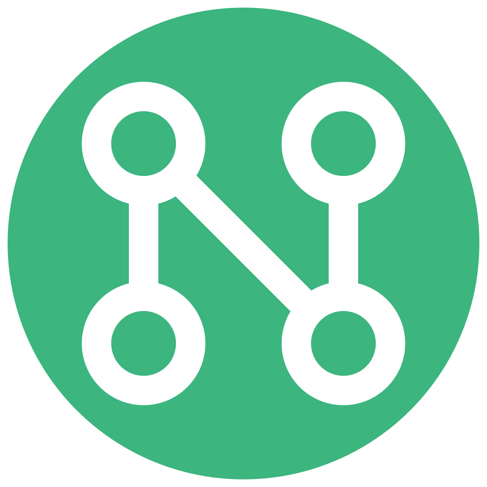

  

  <b>English</b> | <a href="README.ru.md">Русский</a> | <a href="README.fa.md">فارسی</a> | <a href="README.es.md">Español</a>

<h1 align="center">Netok</h1>

  <b>Network diagnostics that speak human language.</b> 
  Netok shows you the full path from your computer to the internet — and explains 
  what's wrong in plain terms, not error codes.

  

  
  
  

---

## Features

<table>
<tr>
<td align="center" width="33%">
<h3>🩺 Diagnostics</h3>

Computer → Wi-Fi → Router → Internet — step-by-step connection check

</td>
<td align="center" width="33%">
<h3>💬 Plain Language</h3>

No technical jargon — clear answers about what's wrong and how to fix it

</td>
<td align="center" width="33%">
<h3>🛡️ DNS Protection</h3>

Cloudflare, AdGuard, CleanBrowsing, or your own custom servers

</td>
</tr>
<tr>
<td align="center">
<h3>🔐 VPN</h3>

VLESS, VMess, Shadowsocks, Trojan, WireGuard via sing-box

</td>
<td align="center">
<h3>📡 Device Discovery</h3>

Scan your local network and identify devices by brand

</td>
<td align="center">
<h3>⚡ Speed Test</h3>

Real-world ratings, not just raw numbers

</td>
</tr>
<tr>
<td align="center">
<h3>🔒 Wi-Fi Security</h3>

Detect encryption vulnerabilities and network threats

</td>
<td align="center">
<h3>🌍 15 Languages</h3>

Full localization including RTL scripts

</td>
<td align="center">
<h3>🎨 Themes</h3>

Light and dark mode with system preference support

</td>
</tr>
</table>

---

## Download

→ [Latest release for Windows](https://github.com/korenyako/netok/releases/latest)

> **Note:** Windows may show a SmartScreen warning on first launch — this is normal
> for unsigned applications. Click "Run anyway" to proceed.

---

## Why Netok

Most network tools are built for engineers. Netok is built for everyone else.

When your internet stops working, you shouldn't need to know what
`DNS_PROBE_FINISHED_NXDOMAIN` means. Netok translates that into something useful:
what's broken, where, and what to do about it.

---

## Platform support

| Platform | Status |
|----------|--------|
| Windows | Ready |
| macOS | Planned |
| Android | In progress |
| iOS | Planned |

---

## Built with

- [Rust](https://www.rust-lang.org/) — core diagnostics engine
- [Tauri](https://tauri.app/) — desktop framework
- [React](https://react.dev/) + TypeScript — UI
- [sing-box](https://sing-box.sagernet.org/) — VPN tunneling

---

## License

GPL-3.0. See [LICENSE](LICENSE) and [THIRD_PARTY_LICENSES.md](THIRD_PARTY_LICENSES.md).

---

*Made by [Anton Korenyako](https://github.com/korenyako)*
