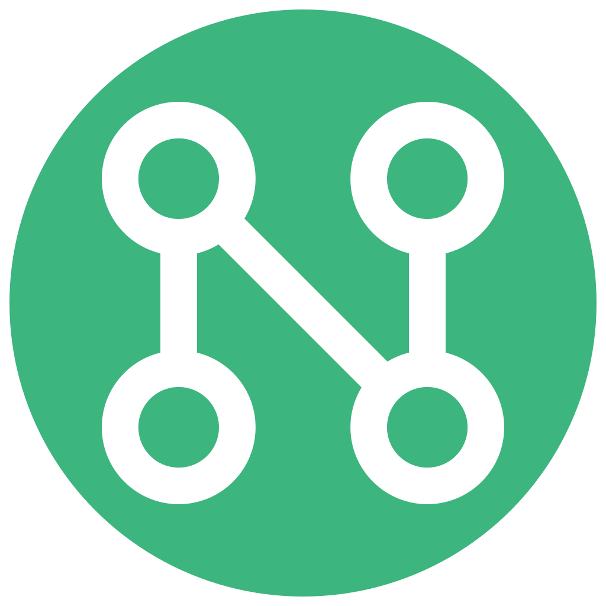
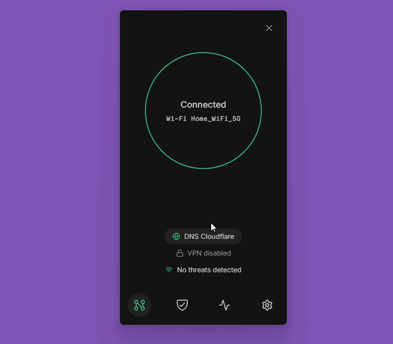
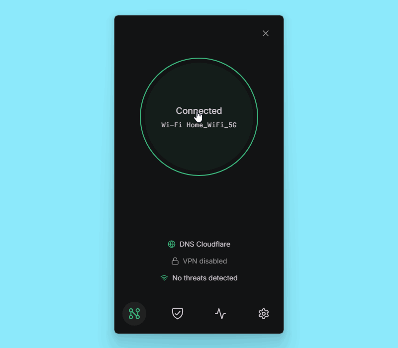
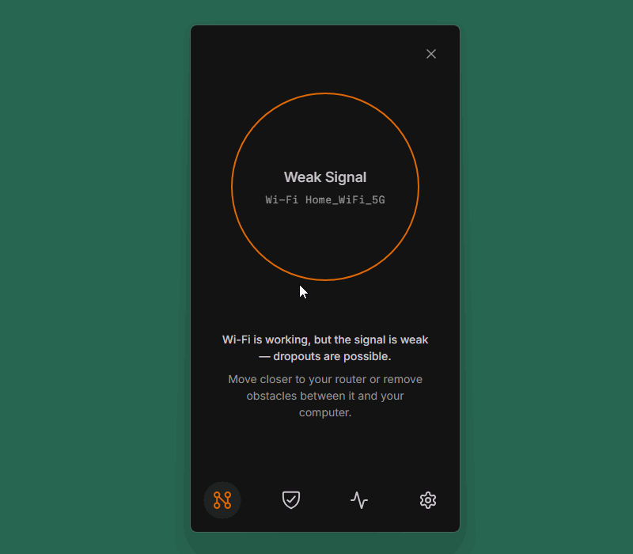
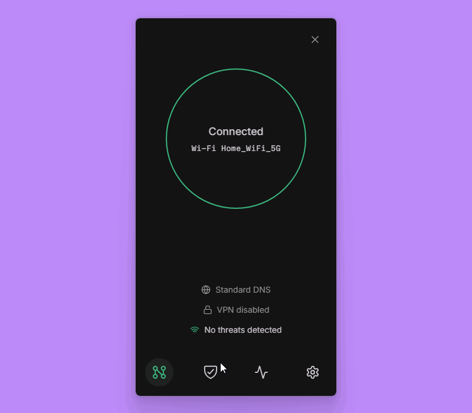
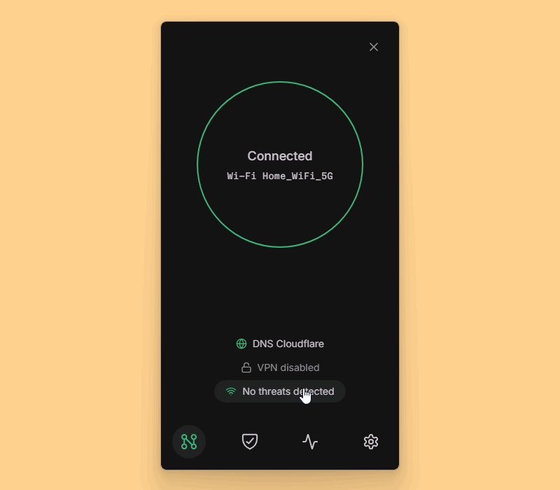
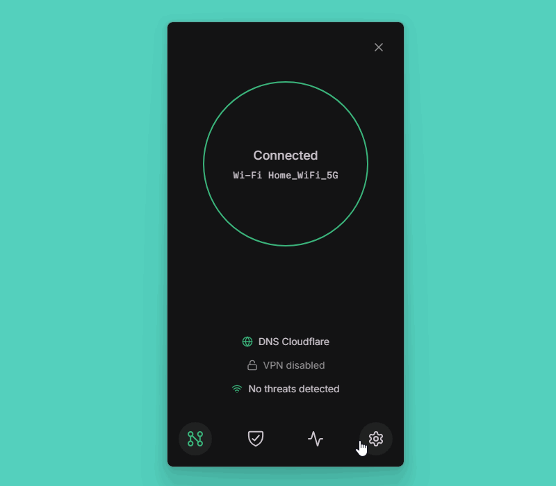
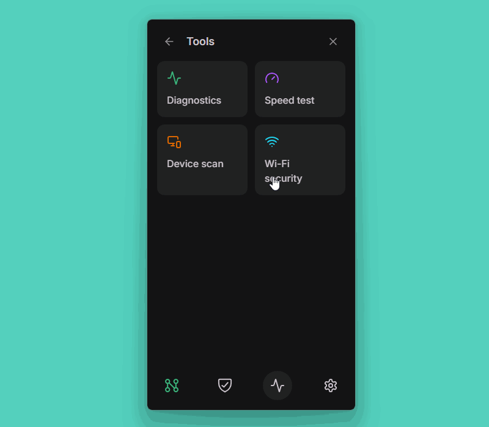
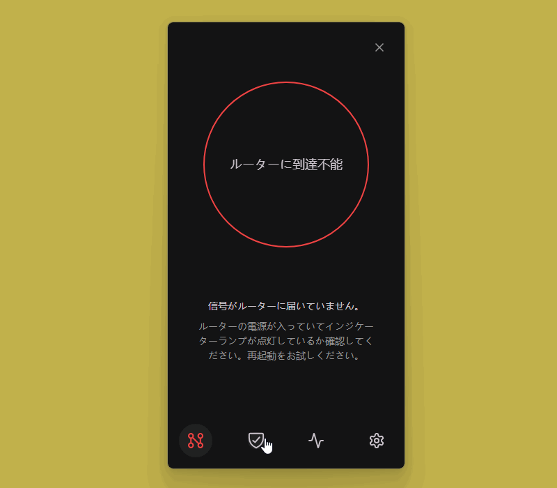

  

  <b>English</b> | <a href="README.de.md">Deutsch</a> | <a href="README.es.md">Español</a> | <a href="README.fa.md">فارسی</a> | <a href="README.fr.md">Français</a> | <a href="README.it.md">Italiano</a> | <a href="README.ja.md">日本語</a> | <a href="README.ko.md">한국어</a> | <a href="README.pl.md">Polski</a> | <a href="README.pt.md">Português</a> | <a href="README.ru.md">Русский</a> | <a href="README.tr.md">Türkçe</a> | <a href="README.uk.md">Українська</a> | <a href="README.zh.md">中文</a>

<h1 align="center">Netok</h1>

  
  

  <b>Network diagnostics that speak human language.</b> 
  Desktop app for network diagnostics, DNS protection, and VPN. 
  See your full connection path from computer to internet, switch DNS providers in one click, 
  and connect through VPN — all explained in plain language, not error codes. 
  Built with Rust + Tauri + React.

  

  
  
  
  

## Why Netok

Most network tools are built for engineers. Netok is built for everyone else.

When your internet stops working, you shouldn't need to know what
`DNS_PROBE_FINISHED_NXDOMAIN` means. Netok translates that into something useful:
what's broken, where, and what to do about it.

## Features

<table>
<tr>
<td align="center" width="33%">
<h3>🩺 Diagnostics</h3>

Computer → Wi-Fi → Router → Internet — step-by-step connection check

</td>
<td align="center" width="33%">
<h3>💬 Plain Language</h3>

No technical jargon — clear answers about what's wrong and how to fix it

</td>
<td align="center" width="33%">
<h3>🛡️ DNS Protection</h3>

Cloudflare, AdGuard, CleanBrowsing, or your own custom servers

</td>
</tr>
<tr>
<td align="center">
<h3>🔐 VPN</h3>

VLESS, VMess, Shadowsocks, Trojan, WireGuard via sing-box

</td>
<td align="center">
<h3>💻 Device Discovery</h3>

Scan your local network and identify devices by brand

</td>
<td align="center">
<h3>⚡ Speed Test</h3>

Real-world ratings, not just raw numbers

</td>
</tr>
<tr>
<td align="center">
<h3>🛜 Wi-Fi Security</h3>

Detect encryption vulnerabilities and network threats

</td>
<td align="center">
<h3>🌍 15 Languages</h3>

Full localization including RTL scripts

</td>
<td align="center">
<h3>🌒 Themes</h3>

Light and dark mode with system preference support

</td>
</tr>
</table>

## Download

  

### Code signing policy

Free code signing provided by [SignPath.io](https://signpath.io), certificate by [SignPath Foundation](https://signpath.org).

- **Roles:** all governance roles (committer, reviewer, approver) are held by [Anton Korenyako](https://github.com/korenyako). See [CONTRIBUTING.md](CONTRIBUTING.md#project-governance) for details.
- **Privacy:** this application does not transfer any information to other networked systems unless specifically requested by the user or required for core diagnostic functionality. See [PRIVACY.md](PRIVACY.md) for the full list of network requests.

## Diagnostics

Computer → Wi-Fi → Router → Internet — see your full connection path step by step. Each node is tested independently so you know exactly where the problem is.

  

## Plain Language

No error codes, no technical jargon. When something breaks, Netok tells you what happened and what to do — in words anyone can understand.

  

## DNS Protection

Switch your DNS provider in one click — Cloudflare, AdGuard, CleanBrowsing, or set your own custom servers. Block ads, malware, and adult content at the network level.

  

## VPN

Connect through VLESS, VMess, Shadowsocks, Trojan, or WireGuard — powered by sing-box. Paste a link, scan a QR code, or import a config file.

  

## Speed Test

Measure your real download and upload speed with human-readable ratings — not just raw numbers.

  

## Wi-Fi Security

Detect weak encryption, open networks, and other vulnerabilities. Know if your Wi-Fi is safe before you connect.

  

## Languages

Netok speaks 15 languages — including right-to-left scripts like Farsi.
Every label, every message, every tooltip is fully translated. No half-baked Google Translate patches — each locale is reviewed for natural phrasing.

**Supported:** English, Deutsch, Español, Français, Italiano, Polski, Português, Türkçe, Українська, Русский, 日本語, 한국어, 中文, فارسی, and more coming.

  

## Built with

- [Rust](https://www.rust-lang.org/) — core diagnostics engine
- [Tauri](https://tauri.app/) — desktop framework
- [React](https://react.dev/) + TypeScript — UI
- [sing-box](https://sing-box.sagernet.org/) — VPN tunneling

## License

GPL-3.0. See [LICENSE](LICENSE) and [THIRD_PARTY_LICENSES.md](THIRD_PARTY_LICENSES.md).

## Privacy & Security

See [PRIVACY.md](PRIVACY.md) and [SECURITY.md](SECURITY.md).

---

*Made by [Anton Korenyako](https://korenyako.github.io)*
