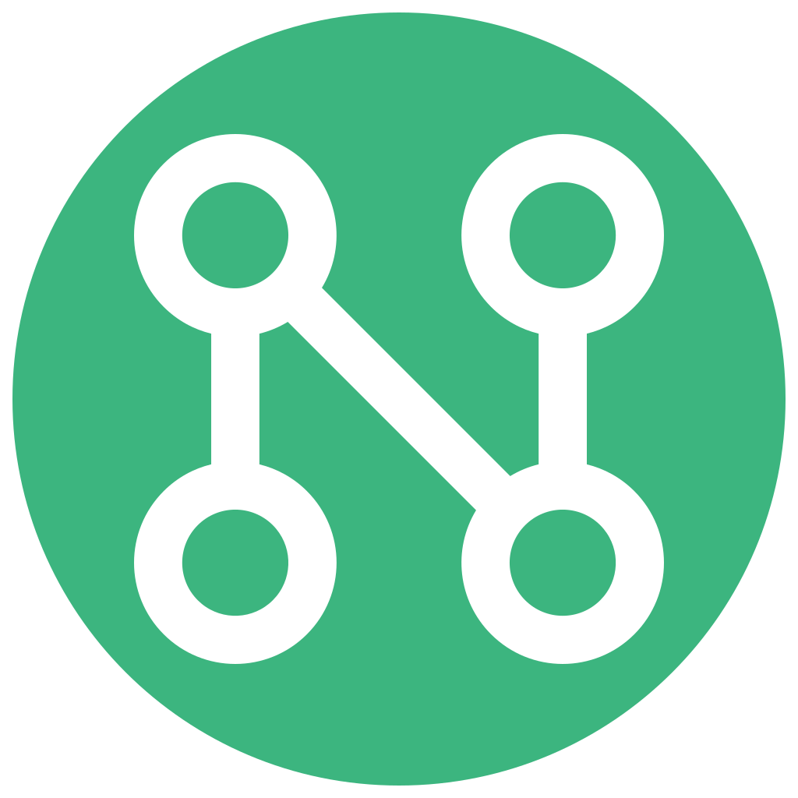

  

  <a href="README.md">English</a> | <a href="README.de.md">Deutsch</a> | <a href="README.es.md">Español</a> | <a href="README.fa.md">فارسی</a> | <a href="README.fr.md">Français</a> | <a href="README.it.md">Italiano</a> | <a href="README.ja.md">日本語</a> | <a href="README.ko.md">한국어</a> | <a href="README.pl.md">Polski</a> | <a href="README.pt-BR.md">Português (Brasil)</a> | <b>Português (Portugal)</b> | <a href="README.ru.md">Русский</a> | <a href="README.tr.md">Türkçe</a> | <a href="README.uk.md">Українська</a> | <a href="README.zh.md">中文</a>

<h1 align="center">Netok</h1>

  
  

  <b>Diagnóstico de rede em linguagem humana.</b> 
  Aplicação desktop para diagnóstico de rede, proteção DNS e VPN. 
  Veja o caminho completo de ligação do computador até à internet, 
  mude de fornecedor DNS com um clique e ligue-se através de VPN — 
  tudo explicado em linguagem simples, não em códigos de erro. 
  Built with Rust + Tauri + React.

  
  
  
  

## Porquê o Netok

A maioria das ferramentas de rede é feita para engenheiros. O Netok é feito para todos os outros.

Quando a sua Internet deixa de funcionar, não deveria precisar de saber o que
`DNS_PROBE_FINISHED_NXDOMAIN` significa. O Netok traduz isso para linguagem clara:
o que falhou, onde e o que fazer.

---

## Funcionalidades

<table>
<tr>
<td align="center" width="33%">
<h3>🩺 Diagnóstico</h3>

Computador → Wi-Fi → Router → Internet — verificação passo a passo da ligação

</td>
<td align="center" width="33%">
<h3>💬 Linguagem simples</h3>

Sem jargão técnico — respostas claras sobre o que está errado e como o corrigir

</td>
<td align="center" width="33%">
<h3>🛡️ Proteção DNS</h3>

Cloudflare, AdGuard, CleanBrowsing ou os seus próprios servidores

</td>
</tr>
<tr>
<td align="center">
<h3>🔐 VPN</h3>

VLESS, VMess, Shadowsocks, Trojan, WireGuard via sing-box

</td>
<td align="center">
<h3>💻 Deteção de dispositivos</h3>

Analise a sua rede local e identifique dispositivos por marca

</td>
<td align="center">
<h3>⚡ Teste de velocidade</h3>

Avaliações compreensíveis, não apenas números brutos

</td>
</tr>
<tr>
<td align="center">
<h3>🛜 Segurança Wi-Fi</h3>

Deteção de vulnerabilidades de encriptação e ameaças de rede

</td>
<td align="center">
<h3>🌍 15 idiomas</h3>

Localização completa, incluindo escritas RTL

</td>
<td align="center">
<h3>🌒 Temas</h3>

Modo claro e escuro com suporte às preferências do sistema

</td>
</tr>
</table>

---

## Transferir

  

### Nota sobre o Windows SmartScreen

O Netok ainda não tem assinatura de código. O Windows pode mostrar um aviso do SmartScreen no primeiro arranque — isto é normal para aplicações não assinadas. Clique em "Mais informações" → "Executar mesmo assim" para continuar.

A aplicação é compilada automaticamente a partir do código-fonte através do GitHub Actions. Pode verificar a compilação consultando o [workflow de lançamento](https://github.com/korenyako/netok/releases) e comparando os checksums.

---

## Por dentro

### Cadeia de diagnóstico

Cada nó da cadeia executa verificações independentes — não é necessário acesso de administrador ao router:

**Computador** — `hostname::get()` para o nome da máquina, `get_if_addrs` para interfaces de rede, Windows WLAN API para detalhes do adaptador.

**Wi-Fi** — Windows WLAN API (`WlanQueryInterface`): SSID, qualidade do sinal convertida para dBm (`-90 + quality/2`), taxa TX, tipo PHY → norma Wi-Fi, canal e banda (2,4/5/6 GHz) de `ulChCenterFrequency`. Tipo de ligação detetado por correspondência de padrão do nome do adaptador.

**Router** — IP da gateway analisado de `route print` (Windows), `ip route` (Linux) ou `netstat -nr` (macOS). Endereço MAC via `Get-NetNeighbor`. Fabricante identificado por pesquisa OUI de prefixo mais longo em 30.000+ entradas compiladas da base de dados de fabricantes do Wireshark.

**Internet** — Duas verificações em paralelo: resolução DNS via `trust_dns_resolver` (tenta `one.one.one.one`, fallback `dns.google`) e acessibilidade HTTP via `reqwest` (tenta Cloudflare trace, fallback `example.com`). Ambas passam → OK, uma passa → Partial, ambas falham → Fail.

### Segurança Wi-Fi

Quatro verificações sequenciais, todas via Windows WLAN API:

**Encriptação** — Lê `dot11AuthAlgorithm` + `dot11CipherAlgorithm`, mapeia para Open (perigo) / WEP, WPA (aviso) / WPA2, WPA3 (seguro).

**Deteção de Evil Twin** — Obtém todos os BSSIDs correspondentes ao SSID ligado via `WlanGetNetworkBssList`. Verifica o bit IEEE 802.11 Privacy em cada AP. Se o mesmo SSID tiver pontos de acesso abertos e encriptados → aviso.

**Deteção de ARP Spoofing** — Lê a tabela ARP completa via `Get-NetNeighbor`, constrói um mapeamento MAC → IP. Se algum MAC não-broadcast mapear para vários IPs incluindo a gateway → perigo.

**Deteção de sequestro DNS** — Resolve `example.com` através do resolver do sistema E através de uma consulta UDP raw para `1.1.1.1`. Se os conjuntos de IP não se sobrepuserem → aviso.

Estado geral de segurança = pior resultado das quatro verificações.

### Teste de velocidade

Baseado no frontend, a usar NDT7 (Network Diagnostic Tool v7) do M-Lab via WebSocket:

- Descoberta de servidor via M-Lab locate API (servidor mais próximo, cache de 5 min)
- Fases de transferência/envio ~10 segundos cada
- **Ping**: mediana de 3 ciclos RTT de ligação/fecho WebSocket
- **Latency**: média de `TCPInfo.SmoothedRTT` sob carga
- **Jitter**: média da diferença absoluta consecutiva das amostras SmoothedRTT
- **Deteção de bufferbloat**: latency > 3× idle ping

Resultados mapeados para tarefas práticas:

| Tarefa | Condição |
|--------|----------|
| Vídeo 4K | transferência ≥ 25 Mbps |
| Jogos online | ping ≤ 50 ms E jitter ≤ 30 ms |
| Videochamadas | transferência ≥ 3 Mbps E ping ≤ 100 ms |
| Vídeo HD | transferência ≥ 10 Mbps |
| Música/Podcasts | transferência ≥ 1 Mbps |
| Redes sociais/Web | transferência ≥ 3 Mbps |
| E-mail/Mensagens | transferência ≥ 0,5 Mbps |

---

## Feito com

- [Rust](https://www.rust-lang.org/) — motor de diagnóstico
- [Tauri](https://tauri.app/) — framework desktop
- [React](https://react.dev/) + TypeScript — interface do utilizador
- [sing-box](https://sing-box.sagernet.org/) — encapsulamento VPN

---

## Licença

GPL-3.0. Consulte [LICENSE](LICENSE) e [THIRD_PARTY_LICENSES.md](THIRD_PARTY_LICENSES.md).

## Privacidade e segurança

Consulte [PRIVACY.md](PRIVACY.md) e [SECURITY.md](SECURITY.md).

---

*Criado por [Anton Korenyako](https://korenyako.github.io)*
